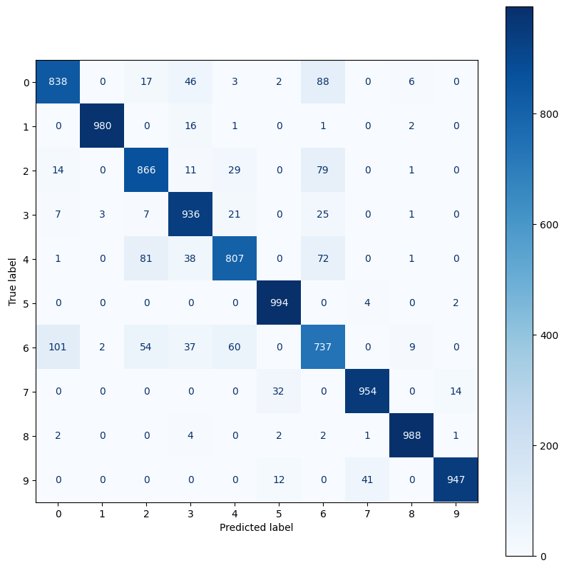
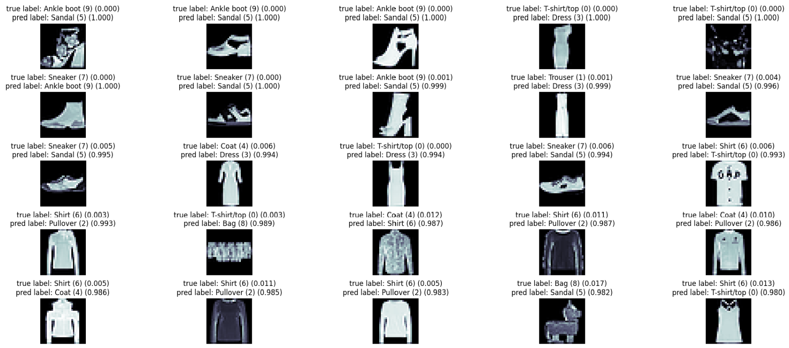

# Project : Classification with Fashion MNIST Clothing (Using a DIY CNN)
------------------------------------------------------------------------------------
## Description

This project can help you understand how to implement classification model with Fashion MNIST Clothing

The repository contains a PyTorch implementation for classifying clothing items in the Fashion MNIST dataset. The Fashion MNIST dataset consists of 70,000 grayscale images in 10 categories, with 7,000 images per category. The goal of this project is to build a neural network model that can classify these images into their respective clothing categories.

## Project Overview

The key steps involved in this project are:
- Loading and preprocessing the **Fashion MNIST** dataset.
- Building a **Convolutional Neural Network (CNN)** using **PyTorch**.
- Training the model on the dataset.
- Evaluating model performance using accuracy and loss metrics.

## Dataset

Fashion MNIST is a dataset of Zalando's article images, which is a drop-in replacement for the original MNIST dataset for handwritten digits. The dataset contains the following clothing categories:

- T-shirt/top
- Trouser
- Pullover
- Dress
- Coat
- Sandal
- Shirt
- Sneaker
- Bag
- Ankle boot

The dataset is split into a training set of 60,000 examples and a test set of 10,000 examples. Each example is a 28x28 grayscale image, associated with a label from 10 classes.

## Libraries Used

The project relies on the following Python libraries:

- **PyTorch**: For building and training the neural network model.
- **Torchvision**: To load the Fashion MNIST dataset.
- **Scikit-learn**: For metrics and data manipulation.
- **Matplotlib**: For visualizing results.

## Model Architecture

The model consists of several layers including:
- Convolutional layers for feature extraction.
- Batch normalization for regularization.
- Fully connected layers for classification.

The activation function used is **ReLU**, and the model is optimized using **Adam** optimizer with a **cross-entropy loss** function.

## Training Process

The training process involves:
1. Setting a random seed for reproducibility.
2. Loading the Fashion MNIST training and test datasets.
3. Applying data transformations such as RandomRotation, RandomCrop, RandomHorizontalFlip, RandomResizedCrop, RandomAffine, Normalization.
4. Defining the DIY CNN architecture.
5. Training the model for a set number of epochs, while monitoring the accuracy and loss.

## Results

The model's performance is evaluated on the test set, with the key metrics being accuracy and confusion matrix analysis.

### Confusion Matrix :

### Incorrect Images with Labels : 

